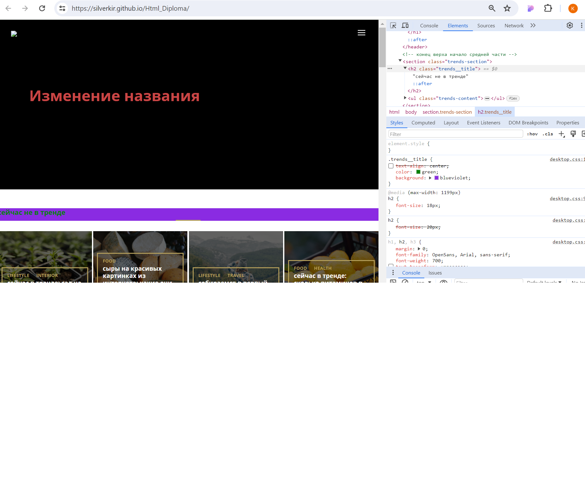

##Домашняя работа №1

Рассматириваемый сайт расположен по ссылке [Сайт](https://silverkir.github.io/Html_Diploma/)

Сайт работает по протоколу https:

Первоначальный oбраз сайта с указанием основной структуры сайта (Было): 

Внесение не менее 10 изменений на страницу с помощью инструмента разработчика:
1. Изменение названия;
2. Изменение цвета букв;
3. Изменение text transform;
4. Удаление логотипа;
5. Удаление фона;
6. Отмена центрирования названия;
7. Изменение заголовка втрого уровня;
8. Изменение цвета заголовка второго уровня;
9. Исключение центрирования заголовка второго уровня;
10. Добавление фона заголовка второго уровня.

Образ сайта с исправлениями (Стало):
